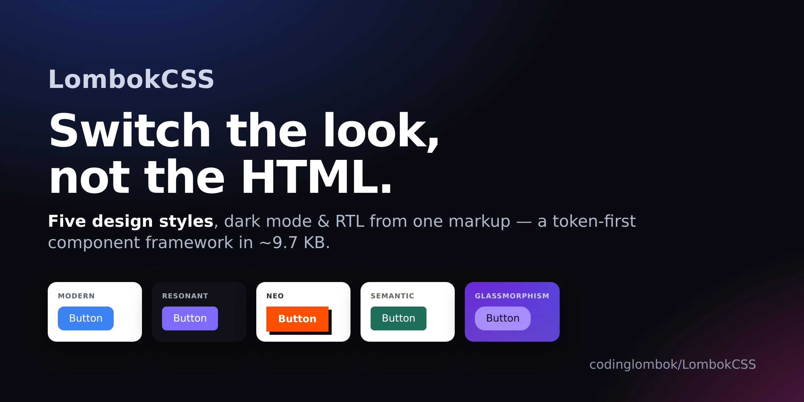
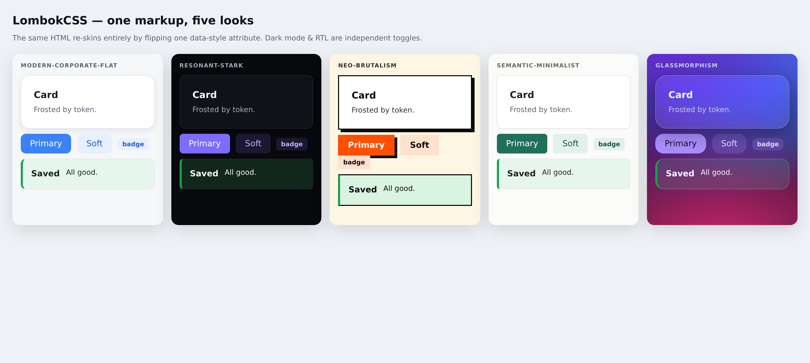
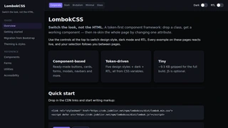
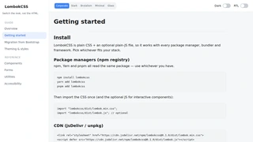
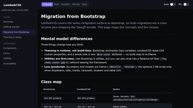
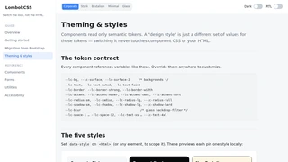
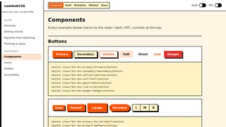
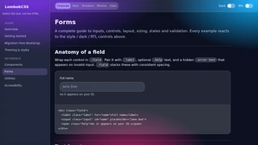
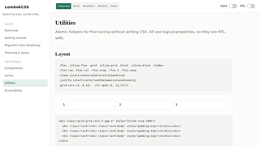
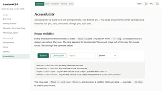

# LombokCSS

> **Switch the look, not the HTML.**
> A modern, **token-first** component CSS framework. Drop a class, get a working
> component — like Bootstrap. Re-theme everything by changing **one attribute** —
> like a design system. Ships at **~9.7 KB gzipped** (full build, minified).

```text
Component-based (Bootstrap)  +  Token-driven theming (design systems)  +  Tiny (Pico/UnoCSS)
```

---

### GitHub

[](https://github.com/codinglombok/LombokCSS/stargazers)
[](https://github.com/codinglombok/LombokCSS/network/members)
[](https://github.com/codinglombok/LombokCSS/issues)
[](https://github.com/codinglombok/LombokCSS/pulls)
[](https://github.com/codinglombok/LombokCSS/releases)
[](https://github.com/codinglombok/LombokCSS/blob/main/LICENSE)
[](https://github.com/codinglombok/LombokCSS/commits/main)
[](https://github.com/codinglombok/LombokCSS)

### npm

[](https://www.npmjs.com/package/lombokcss)
[](https://www.npmjs.com/package/lombokcss)
[](https://www.npmjs.com/package/lombokcss)
[](https://www.jsdelivr.com/package/npm/lombokcss)


### GitHub Packages

[](https://github.com/codinglombok/LombokCSS/pkgs/container/lombokcss)
[](https://github.com/codinglombok/LombokCSS/pkgs/npm/lombokcss)
[](https://github.com/codinglombok/LombokCSS/pkgs/nuget/codinglombok.LombokCSS)
[](https://github.com/codinglombok/LombokCSS/pkgs/rubygems/lombokcss)
[](https://github.com/codinglombok/LombokCSS/pkgs/maven/com.github.codinglombok/lombokcss)

### Quality

[](https://github.com/codinglombok/LombokCSS/actions/workflows/ci.yml)
[](https://github.com/codinglombok/LombokCSS/actions/workflows/linter.yml)
[](https://github.com/codinglombok/LombokCSS/actions/workflows/visual.yml)
[](https://github.com/codinglombok/LombokCSS/tree/main/tests)
[](#)
[](https://conventionalcommits.org)
[](https://prettier.io)

### SourceForge

[](https://sourceforge.net/projects/lombokcss/files/latest/download)
[](https://sourceforge.net/projects/lombokcss/files/latest/download)
[](https://sourceforge.net/projects/lombokcss/files/latest/download)
[](https://sourceforge.net/projects/lombokcss)

### Community

[](https://github.com/codinglombok/LombokCSS/graphs/contributors)
[](https://github.com/codinglombok/LombokCSS/discussions)
[](https://github.com/sponsors/codinglombok)
[](https://github.com/codinglombok/LombokCSS/blob/main/CONTRIBUTING.md)

### Lombok Ecosystem

[](https://github.com/codinglombok/LombokClarion)
[](https://github.com/codinglombok/LombokCharts)
[](https://github.com/codinglombok/LombokQRCode)
[](https://github.com/codinglombok/LombokTableSheet)
[](https://github.com/codinglombok/LombokECC)

---

[](https://codinglombok.github.io/LombokCSS/)
[](https://codinglombok.github.io/LombokCSS/)

---

## Documentation

|                                                                                                                                           |                                                                                                                                                     |
| ----------------------------------------------------------------------------------------------------------------------------------------- | --------------------------------------------------------------------------------------------------------------------------------------------------- |
| **Overview**                                                                                                                              | **Getting Started**                                                                                                                                 |
| [](https://codinglombok.github.io/LombokCSS/index.html)                         | [](https://codinglombok.github.io/LombokCSS/getting-started.html) |
| **Migration from Bootstrap**                                                                                                              | **Theming & Styles**                                                                                                                                |
| [](https://codinglombok.github.io/LombokCSS/migration.html) | [](https://codinglombok.github.io/LombokCSS/theming.html)                |
| **Components**                                                                                                                            | **Forms**                                                                                                                                           |
| [](https://codinglombok.github.io/LombokCSS/components.html)              | [](https://codinglombok.github.io/LombokCSS/forms.html)                                       |
| **Utilities**                                                                                                                             | **Accessibility**                                                                                                                                   |
| [](https://codinglombok.github.io/LombokCSS/utilities.html)           | [](https://codinglombok.github.io/LombokCSS/accessibility.html)         |

---

## Why it's different

Most frameworks bake their look into each component, so changing the visual
style means overriding hundreds of rules. LombokCSS inverts that:

- **Components read only semantic tokens** (`--lc-surface`, `--lc-text`, `--lc-radius`, `--lc-shadow`, `--lc-accent`, …).
- **A "design style" is just a different set of token values.** Switching it never touches component CSS or your HTML.

```html
<!-- same markup, five identities -->
<html data-style="neo-brutalism">
  <!-- thick borders, hard shadows -->
  <html data-style="glassmorphism">
    <!-- frosted glass -->
    <html data-style="resonant-stark">
      <!-- Linear-style dark -->
    </html>
  </html>
</html>
```

Dark mode (`data-theme`) and RTL (`dir`) are **independent** axes that compose
with any style.

---

## Install

**CDN (jsDelivr)** — fastest start:

```html
<link rel="stylesheet" href="https://cdn.jsdelivr.net/npm/lombokcss/dist/lombok.min.css" />
<script defer src="https://cdn.jsdelivr.net/npm/lombokcss/dist/lombok.js"></script>
```

**npm:**

```bash
npm install lombokcss
# or: yarn add lombokcss   /   pnpm add lombokcss
```

```js
import "lombokcss/dist/lombok.min.css";
import "lombokcss/dist/lombok.js"; // optional, only for interactive components
```

Pin a version for production (jsDelivr):

```html
<link rel="stylesheet" href="https://cdn.jsdelivr.net/npm/lombokcss@0.1.8/dist/lombok.min.css" />
```

**Download:** grab `dist/lombok.min.css` (+ optional `dist/lombok.js`) and link them directly.

The JS is **optional**. Accordions, modals and `<dialog>` work natively without
it; the script only adds dropdown/tab/toast/table-sort/navbar-toggle/carousel/drawer/popover behavior.

---

**Other registries:**

| Registry | Install command |
| -------- | --------------- |
| **GitHub Packages (npm)** | `npm install @codinglombok/lombokcss` |
| **GitHub Packages (Container)** | `docker pull ghcr.io/codinglombok/lombokcss:0.1.8` |
| **GitHub Packages (NuGet)** | `dotnet add package codinglombok.LombokCSS` |
| **GitHub Packages (RubyGems)** | `gem "lombokcss"` → `Lombokcss.assets_path` for Sprockets |
| **GitHub Packages (Maven)** | `<groupId>com.github.codinglombok</groupId>` `<artifactId>lombokcss</artifactId>` |

Works with any bundler (Vite/Webpack/Parcel) and framework (Vue/React/Svelte) —
just import the CSS. See the **Getting started** docs for per-tool snippets.

## The five design styles

| `data-style`            | Character                                                                                   |
| ----------------------- | ------------------------------------------------------------------------------------------- |
| `modern-corporate-flat` | Clean, flat, neutral + one brand color, medium radius, soft shadows (default)               |
| `resonant-stark`        | Linear-style dark: high contrast, subtle borders, tight type, violet accent                 |
| `neo-brutalism`         | Thick black borders, hard offset shadows, bold blocks, zero radius                          |
| `semantic-minimalist`   | Minimal, neutral, generous spacing, serif display, readability-first                        |
| `glassmorphism`         | Frosted glass over a gradient; translucent surfaces, glowing borders (with opaque fallback) |

---

## Theming guide

Everything is a CSS variable. Override on `:root` (or a scope) to customize:

```css
:root {
  --lc-accent: #e11d48; /* brand color            */
  --lc-accent-hover: #be123c;
  --lc-radius: 4px; /* tighter corners        */
  --lc-font-sans: "Inter", system-ui, sans-serif;
  --lc-space-4: 1.1rem; /* rescale spacing        */
}
```

**Dark mode** — three ways, they all work together:

```html
<html data-theme="dark">  <!-- force dark           -->
<html data-theme="light"> <!-- force light           -->
<html>                     <!-- follows the OS setting -->
```

**RTL** — set the document direction; all components use logical properties:

```html
<html dir="rtl" lang="ar">
```

**Make your own style** — add a token block, no component edits:

```css
[data-style="sunset"] {
  --lc-bg: #1a0f0f;
  --lc-surface: #2a1818;
  --lc-text: #ffe;
  --lc-accent: #ff7849;
  --lc-radius: 14px;
  --lc-shadow: 0 8px 24px rgba(0, 0, 0, 0.4);
}
```

---

## Component usage

```html
<!-- Buttons -->
<button class="btn btn-primary">Primary</button>
<button class="btn btn-outline btn-lg btn-rounded">Big outline</button>
<span class="btn-group">
  <button class="btn btn-secondary">L</button><button class="btn btn-secondary">R</button>
</span>

<!-- Card -->
<article class="card">
  <div class="card-body">
    <h3 class="card-title">Title</h3>
    <p class="card-text">Body copy.</p>
  </div>
  <div class="card-footer">Footer</div>
</article>

<!-- Alert / Badge -->
<div class="alert alert-success">
  <div>
    <div class="alert-title">Saved</div>
    All good.
  </div>
</div>
<span class="badge badge-primary">new</span>

<!-- Tabs (JS) -->
<div class="tabs" role="tablist">
  <button role="tab" aria-selected="true" aria-controls="p1">One</button>
  <button role="tab" aria-selected="false" aria-controls="p2">Two</button>
</div>
<div class="tab-panel" id="p1" role="tabpanel">…</div>
<div class="tab-panel" id="p2" role="tabpanel" hidden>…</div>

<!-- Modal (native <dialog>) -->
<button class="btn btn-primary" data-modal-open="m">Open</button>
<dialog class="modal" id="m">
  <div class="modal-card">
    <div class="modal-header">
      Title <button class="btn btn-ghost btn-icon btn-sm" data-modal-close>✕</button>
    </div>
    <div class="modal-body">Body</div>
    <div class="modal-footer"><button class="btn btn-primary" data-modal-close>OK</button></div>
  </div>
</dialog>

<!-- Toast (JS API) -->
<button class="btn" onclick="Lombok.toast('Done', {variant:'success'})">Notify</button>

<!-- Carousel (CSS scroll-snap + JS nav) -->
<div class="carousel">
  <div class="carousel-track">
    <div class="carousel-slide is-third card">…</div>
    <div class="carousel-slide is-third card">…</div>
  </div>
</div>
```

Other components included: `dropdown`, `drawer`/offcanvas, `popover`, `navbar`
(+ mobile toggle), `accordion` (native `<details>`, no JS), `breadcrumb`,
`pagination`, `avatar`/`avatar-group`, `progress`, `spinner`, `skeleton`,
`stat`, `list-group`, `steps`, `timeline`, `sidebar`, sortable `table`,
CSS-only tooltip (`data-tip="…"`), `kbd`, `code`/`pre`, full `form` system
(inputs, validation, switches, input-groups).

### Utilities

Layout (`flex`, `grid`, `items-*`, `justify-*`, `gap-*`, `grid-cols-1..12`),
spacing (`p-*`, `m-*`, logical), sizing (`w-full`, `max-w-*`, `min-h-screen`),
type (`text-sm..3xl`, `font-*`, `text-start/center/end`), color
(`bg-surface`, `text-muted`, `border`), radius/shadow, position/z-index, plus
responsive prefixes `sm: md: lg: xl:` (e.g. `md:grid-cols-3`).

### Classless mode

Plain semantic HTML is styled with zero classes — headings, paragraphs, links,
lists, `blockquote`, `table`, form inputs, `code`/`pre`/`kbd`. Good for prose
and quick prototypes.

---

## Architecture

```text
src/
  variables.css   → token architecture (the contract every component depends on)
  core.css        → reset/reboot + base element styles (= classless mode)
  themes.css      → token value sets per design preset (data-style)
  components.css  → all components (read tokens only, RTL-safe, glass-aware)
  utilities.css   → atomic utilities + responsive prefixes
  print.css       → ink-friendly high-contrast output
dist/
  lombok.css      → bundled, unminified (readable)
  lombok.min.css  → bundled + minified (ship this)
  lombok.js       → optional interactive behaviors
```

### Token layers

1. **Primitives & scale** — spacing, font sizes, raw palette.
2. **Semantic tokens** — `--lc-surface`, `--lc-text`, `--lc-border`, `--lc-accent`, `--lc-radius`, `--lc-shadow`, `--lc-blur`, status colors. **Components only ever reference these.**
3. **Style presets** (`[data-style="…"]`) re-map the semantic tokens.
4. **Dark overlay** (`[data-theme="dark"]` / `prefers-color-scheme`) re-maps color tokens; composes with presets via `[data-style][data-theme]` pairs.

---

## Browser support & accessibility

Modern CSS used with graceful fallbacks: `:has()`, `:user-invalid`,
`accent-color`, `backdrop-filter` (opaque fallback via `@supports`), logical
properties, native `<dialog>`/`<details>`. Components ship with visible
`:focus-visible` rings, ARIA hooks, and respect `prefers-reduced-motion`.

## Testing

Visual-regression + behavior tests run via Playwright in CI:

```bash
npm test                    # size budget + SSR import guard (no browser)
npm run test:behavior       # 42 Playwright behavior tests
npm run test:visual         # visual regression against committed baselines
npm run test:visual:update  # refresh baselines after intentional changes
```

Baselines are browser-specific. CI runs in a pinned Playwright container
(`mcr.microsoft.com/playwright:v1.56.0-noble`) so pixels match.

## Publishing (maintainers)

> Full step-by-step setup (repo creation, branch protection, secrets, Pages,
> release-please flow, npm/CDN, troubleshooting) is in **[GITHUB_SETUP.md](GITHUB_SETUP.md)**.

Release flow uses **release-please** with Conventional Commits:

```text
commit (fix:/feat:) → push → release-please opens PR → merge → GitHub Release
  → npm-publish.yml publishes to npmjs.org
  → publish-packages.yml publishes to all 5 GitHub Packages registries
  → jsDelivr/unpkg serve from npm automatically
  → Pages redeploys docs
```

## Documentation site

Full multi-page docs at `docs/`: Overview, Getting started, Migration from
Bootstrap, Theming, Components, Forms, Utilities, Accessibility. Open
`docs/index.html` locally or visit the live site at
**<https://codinglombok.github.io/LombokCSS/>**.

Need help? See **[SUPPORT.md](SUPPORT.md)**.

## License

MIT — see [LICENSE](LICENSE).
